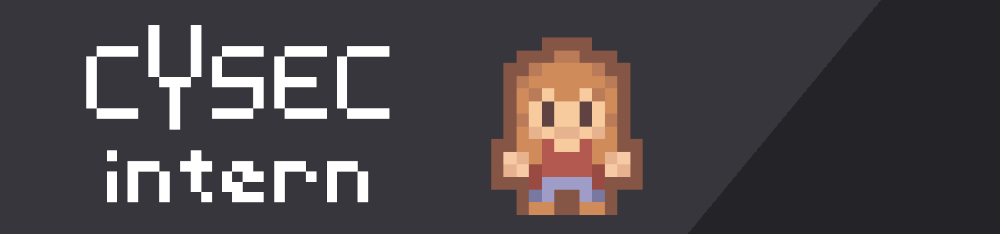

&nbsp;
&nbsp;

# CySec Intern

[CySec Intern](https://cysec-intern.silentbyte.com) is a casual game where you explore the world as a newly hired intern and learn more about cybersecurity concepts on your journey. It has been created for the [Secureworks® Cybersecurity Literacy Challenge](https://devpost.com/software/cysec-intern).

The project page [can be found here](https://devpost.com/software/cysec-intern). Your vote is highly appreciated. 😊

An online demo is [available here](https://cysec-intern.silentbyte.com).

Watch a video of the [presentation and gameplay on YouTube](https://www.youtube.com/watch?v=YiJ530jxeTw).

Follow on Twitter: [@RicoBeti](https://twitter.com/RicoBeti).

## Inspiration

Cybersecurity is becoming exponentially more important as threats are increasing around the world. It seems as though there are new reports of hacks, data leaks, security breaches, and denial of service attacks almost on a daily basis.

That is why it is important that all people have a good grasp on basic cybersecurity concepts. Unfortunately, many of these concepts seem unintuitive for the average computer user. With the game we have built, we try to make cybersecurity more approachable.

## What it does

CySec Intern is essentially a top-down RPG where you play as a newly hired intern. You can walk around, explore the world, and interact with objects and people. There are numerous cybersecurity-related challenges spread around the world that need to be found and solved correctly.

Each challenge is a different but generally common scenario many regular computer users will have encountered before but may not have known how to act or realized that their cybersecurity may be at risk. For each task, there is a description of what the correct way to approach this issue is and a link that leads to additional information about the topic.

While playing, the game is keeping track of the score and what challenges have been solved.

CySec Intern is designed with modularity in mind, so that it is trivial to add more challenges or customize them for a specific event. For example, we are considering adding more challenges in the style of Capture The Flag (CTF), which are common in the cybersecurity community and are generally much harder to solve (i.e. solving them requires more in-depth computer knowledge).

## How we built it

The game has been built using the [Godot Game Engine](https://godotengine.org). The game grew organically and we constantly tweaked and extended it, so it is difficult to gave a clear order of events.

We started by building a small part of the city using tilemap systems. We then continously expanded the game world and started implementing 'actors' and 'interactables', as well as a dialog/notification system, a portal/teleport system, a scene transition system, and a system that keeps tracks of 'game facts' (i.e. what parts of the world have been accessed, what the scores are, etc.).

## Challenges we ran into

This has been the first time that we have worked on a game, so the most challenging aspect was getting started and figuring out what resources will be needed for the game both in terms of graphics and sound assets but also in terms of programming and the engine itself.

One particular challenge we ran into was getting portals to work properly so that the player could be seamlessly transported between different scenes, accompanied by a nice transition effect.

## Accomplishments that we're proud of

We are pleased that we persisted to bring this game into a playable state despite it being our first exposure to hands-on game design and that we managed to add enough content and present it in a way that is hopefully useful to normal computer users that are eager to learn more about cybersecurity.

## What we learned

Here are a few things among many that we have learned during this hackathon:

- We have gained valuable skills in the area of game development with an upcoming game engine.
- The design of the game world takes way more time than we initially thought.
- Presenting the topic in an interesting way is challenging.
- There's always something else that can be polished.
- A nice refresher regarding cybersecurity concepts.

## What's next for CySec Intern

We would like to further extend the game and add more difficult challenges that require more in-depth knowledge. For example, there could be in-game interactable computer terminals that can be accessed through which challenges could take place such as trying to write a basic SQL injection to access data (CTF style challenges).

## Attribution

Tilesets & Sound Effects: Assets by [Kenney](https://www.kenney.nl).

Background Music: Ludum Dare 32 - Track 2, by [Abstraction Music](http://www.abstractionmusic.com).
